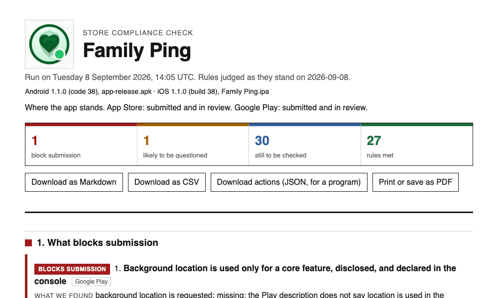
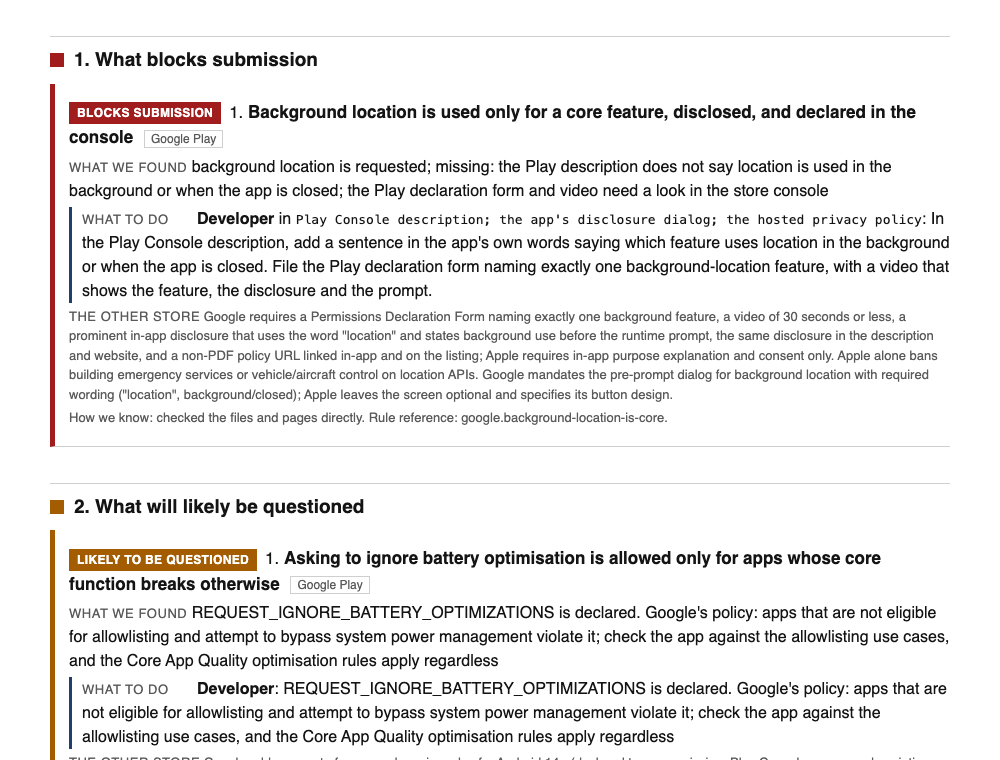
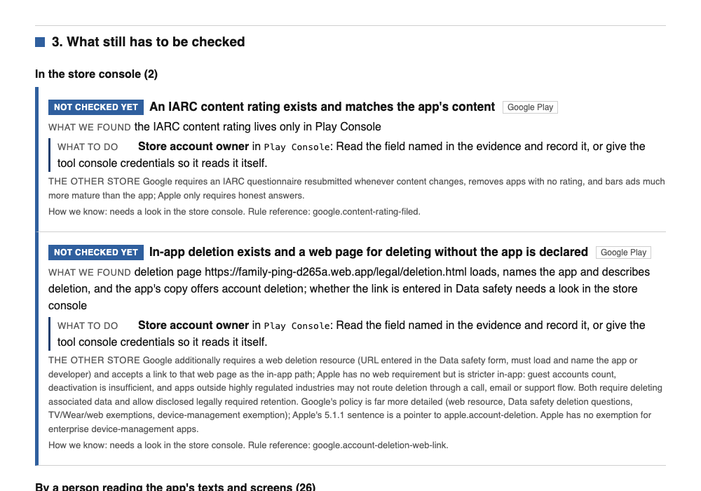

# Okkok

**OK for the App Store. OK for Google Play.** Does this app meet both stores'
rules, and how do we know?

The code is open source under the AGPL; the name and the mark belong to
Editerra AB (see [BRAND.md](BRAND.md)).

Point okkok at an app directory. It reads what the stores read, the built
package and the files around it, and never the source code. It does not care
what the app was built with: Flutter, React Native, Swift, Kotlin, Unity, all
look the same to it, because it reads the same `.ipa`, `.app`, `.apk` and
`.aab` files the stores receive.

It checks 88 rules drawn from the Apple App Review Guidelines, Apple's design
and privacy requirements and the Google Play Developer Program Policies, and
writes one report where every finding says what was found, what to do, who
does it, where, and how the tool knows.



## What you get

A single HTML page, `report.html`, generated on every run and safe to send on
its own. It carries its own exports (Markdown, CSV, and an `actions.json` a
program or an AI agent can act on) and prints to PDF.



The report has six fixed sections, in the same order every time:

1. **What blocks submission.** Red.
2. **What will likely be questioned.** Amber.
3. **What still has to be checked**, grouped by who can answer: the store
   console, a person reading the app's texts, a phone, or a date. Blue.
4. **Worth knowing.** Grey.
5. **What meets the rules.** Green, collapsed.
6. **What does not apply to this app, and why.** Every skipped rule states
   its reason.



Every finding ends with **How we know**: the tool checked the files and pages
directly, a reviewer or model said so, it was inferred from other facts, it
needs a look in the store console, or it needs a test on a phone. A row
without that marker fails the build. An answer a reviewer or model gave is
kept only while the facts it was given are unchanged.

## Install

Python 3.11 or later. No other dependency for the command line.

```sh
pip install git+https://github.com/petresandu-cloud/okkok
# or, to keep it out of your project's environment:
pipx install git+https://github.com/petresandu-cloud/okkok
```

Or from a checkout, which is also how you get the tests and the tools:

```sh
git clone https://github.com/petresandu-cloud/okkok
cd okkok
python3 -m okkok --version     # nothing to install; the standard library is enough
python3 -m unittest                 # 47 tests
```

The optional adapter for AI models over the Model Context Protocol needs one
package: `pip install "okkok[mcp]"`.

## First run

```sh
okkok audit path/to/app
```

That is the whole first run. It reads the rule pages (about a minute for the
113 pages, on every run, so a rule that changed since the last run is caught
before it is applied), looks the app up on both stores by its identifier,
reads the app, and writes a `okkok/` directory next to your inputs with
`report.html`, the exports and the data behind them. Open `report.html` in
any browser.

Add `--offline` to skip the network entirely: the rule-page sweep, the store
lookups and the console readers. An offline run relies on the rule pages as
they were last verified and the report says so. Add `--as-of YYYY-MM-DD` to
judge dated rules as of another day.

Note that the store lookup is by identifier: an app whose package name or
bundle id is already published shows as public even when the directory holds
an unreleased build.

If the app is on a test track or in review and you have no console keys to
hand, say so; the tool cannot see it otherwise, and twenty rules only apply
from that stage on. The page labels it as your statement, not an observation:

```sh
okkok audit path/to/app --stated-stage apple=in-review --stated-stage google=in-review --stated-by "Jane, 8 Sep"
```

### What the app directory needs

okkok searches the directory you give it, recursively, for the newest
matching build:

| It looks for | Used for |
|---|---|
| `*.ipa`, or a device `*.app` bundle | iOS: Info.plist, entitlements, provisioning profile, linked frameworks, bundled SDK privacy manifests, the executable's selectors |
| `*.apk` (and `*.aab` when `java` and bundletool are present) | Android: manifest, permissions, services, target API, and the compiled code's references to platform classes |
| `AndroidManifest.xml`, `build.gradle`, `Info.plist`, `*.entitlements`, `Podfile.lock` | Source-level declarations, compared against the built ones |
| `okkok/listing.toml` | The store listing text until a console is read. Without it, every rule about the listing stays open and says so |
| `okkok/texts/*.txt` | In-app copy the app chooses to expose for review, one file per screen |

With nothing built, the report says so in one sentence and runs the
source-level rules only. The stage each store is at (source only, built,
internal beta, in review, public) is detected from the evidence, and the rules
are scoped to it.

`listing.toml` looks like this:

```toml
# Console limits: Apple name 30, subtitle 30, keywords 100; Google title 30, short description 80.
[listing]
name = "Sample App"
privacy_policy_url = "https://example.com/privacy"
support_url = "https://example.com/support"
deletion_url = "https://example.com/delete-account"

[listing.apple]
subtitle = "One line under the name"
description = """What the app does, in the words the store shows."""
keywords = "comma,separated,keywords"

[listing.google]
short_description = "Eighty characters at most."
full_description = """What the app does, in the words the store shows."""
```

### Store consoles, read only

With credentials in the environment, `audit` reads TestFlight and Play track
state, review state, and Play's declarations and Data safety form. It only
ever reads. Keys are never copied anywhere.

```sh
export APP_STORE_CONNECT_API_KEY_ID=...
export APP_STORE_CONNECT_API_ISSUER_ID=...
export APP_STORE_CONNECT_API_KEY_PATH=~/keys/AuthKey_XXX.p8
export GOOGLE_PLAY_SERVICE_ACCOUNT_JSON=~/keys/play-service-account.json
```

## The loop

```
okkok corpus fetch                   the rule pages: fetch, fingerprint, verify quotes
okkok audit <app>                    facts, stage, grid, report
okkok rule <rule>                    one rule, its rule pages and their cached text
okkok judge <app> <rule> PASS|FAIL|RISK|NOTE "<evidence>" --by "<who>"
okkok adversarial <app>              the second pass: try to break the first
okkok propose <app> <rule>           a fix derived from this app's own facts, or a question
okkok resolve <app> <rule> ...       a finding was fixed: proof and a guard, appended
okkok check <app>                    no network: grid well-formed, page generated, corpus unchanged
okkok texts <app>                    every text the app presents, for a human-eye reading
okkok model <app>                    what the app does, from the facts alone
okkok corpus verify|accept|list
okkok self-test                      every probe checks itself against a known input
```

Rules are of two kinds. **Mechanical** rules are decided by code, with no
model in the loop: permission and purpose-string pairs, foreground service
types, target API levels, cleartext traffic, privacy manifests, listing
lengths and placeholders, and so on. **Judgement** rules ask a question a
person or a model must answer by reading the app's texts and screens; their
answers are recorded with `judge`, carry the reviewer's name, and are
discarded automatically when the facts they were given change.

`adversarial` is a first-class pass, not an afterthought. It verifies every
quotation against the cached rule text, lists rule pages that have gone stale
or unreadable, names Apple guideline sections and Google policies no rule
cites, and hands back every judgement row with its raw text for a second
opinion.

Everything the run produces goes to `<app>/okkok/`: `probes.json`
(facts), `stage.json`, `grid.json`, `report.html` with `grid.md`, `grid.csv`
and `actions.json` beside it, `judgements.jsonl`, `resolution-log.jsonl`. The
app keeps them. This repository keeps only rules and rule-page records.

## In your pipeline

- **GitHub Action:** `uses: petresandu-cloud/okkok@v0.1.1` with `app-dir`; it audits the built package, writes a summary to the job and fails on findings that block submission (`fail-on: block`, `risk` or `none`).
- **fastlane:** the plugin under `integrations/fastlane-plugin-okkok` adds an `okkok` action for a lane.
- **The site:** `python3 tools/site.py` renders a page per rule, the common-rejection pages and the rule-change feed into `site/`, with a sitemap, a robots policy, an `llms.txt` and structured data on every page.
- **Machine accessibility:** `python3 tools/aiready.py https://your-site` checks whether search engines and AI answer engines can reach and understand a site; the same checks the Okkok site passes.

## When the stores change a rule

Every run re-reads the rule pages. A page whose fingerprint changed is logged
in `okkok/corpus/changes.jsonl` and every rule resting on it waits until a
person reads the diff and accepts it with one sentence in our words:

```sh
okkok corpus accept google.user-data --summary "Now names a 90-day limit for retained data." --by "your name"
okkok changes            # renders site/changes.md and an RSS feed
```

That log, in our words and never the stores', is the change feed.

## Using it with an AI model

The command line is the interface: JSON in, JSON out. Any model, script or CI
job can drive it. For models that speak the Model Context Protocol there is a
thin adapter exposing the same commands and nothing more:

```sh
pip install "okkok[mcp]"
python3 -m okkok.mcp_server
```

Tools: `audit_run`, `audit_get_rule`, `audit_get_probes`, `audit_get_texts`,
`audit_judge`, `audit_adversarial`, `fix_propose`, `fix_app_model`.

The deterministic half runs with no model at all. A model is only ever asked
the judgement questions, and its answers are labelled as such on the page.

## What it never does

- **Never reads source code.** Usage evidence comes from the binaries: the
  compiled Android code's string pool and the iOS executable's load commands
  and selectors. Obfuscation renames an app's own classes, never the platform
  classes it calls.
- **Never stores the stores' policy text.** A rule-page record holds the
  page's address, the heading expected there, the time it was read, a
  fingerprint of its normalised text, our own paraphrase, and at most one
  short quote that is verified against the live page on every fetch. The full
  text lives in a local cache that is never committed.
- **Never writes to a store console.** Console access is read-only by
  construction.
- **Never lets a page be edited by hand.** The report is generated from the
  grid and carries its fingerprint; `check` fails on a hand edit.

## How the rules are kept honest

Each rule is a short TOML record naming the rule pages it rests on. When a
page's fingerprint changes, every rule resting on it goes to *not checked
yet* until a person looks at the diff and accepts it. Rules with a future
effective date show as *starts later* until that date. Apple and Google rules
that cover the same ground are linked in a crosswalk of 103 pairs, and a
finding on one store shows what the other store asks instead.

The paraphrases were written by reading each page, then rewritten by an
independent adversarial pass and reviewed for fidelity against the page text.
Their review state is recorded on each record.

## Development

```sh
python3 -m unittest             # the suite
python3 -m okkok self-test # every probe against a known input
```

The report's structure, words and colours are a contract, written down in
[REPORT-PRINCIPLES.md](REPORT-PRINCIPLES.md) and enforced by
`tests/test_report.py`. Why it is built this way is in [DESIGN.md](DESIGN.md).
See [CONTRIBUTING.md](CONTRIBUTING.md) before adding a rule.

## Licence

Copyright © 2026 Editerra AB. Okkok, the gate-and-check mark and the okkok
wordmark are trademarks of Editerra AB and are not covered by the licence. Published under the GNU Affero General Public
License, version 3 or later: see [LICENSE](LICENSE). Free to use, change and
share on those terms. For use in a closed product or a hosted service, or for
support under an agreement, see [COMMERCIAL-LICENSE.md](COMMERCIAL-LICENSE.md).
